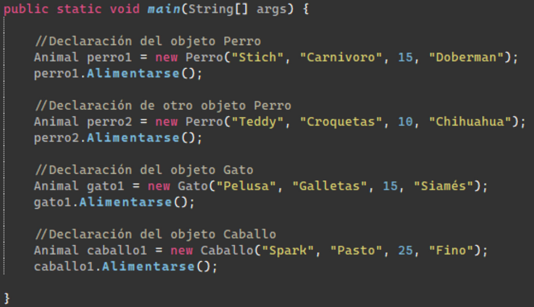
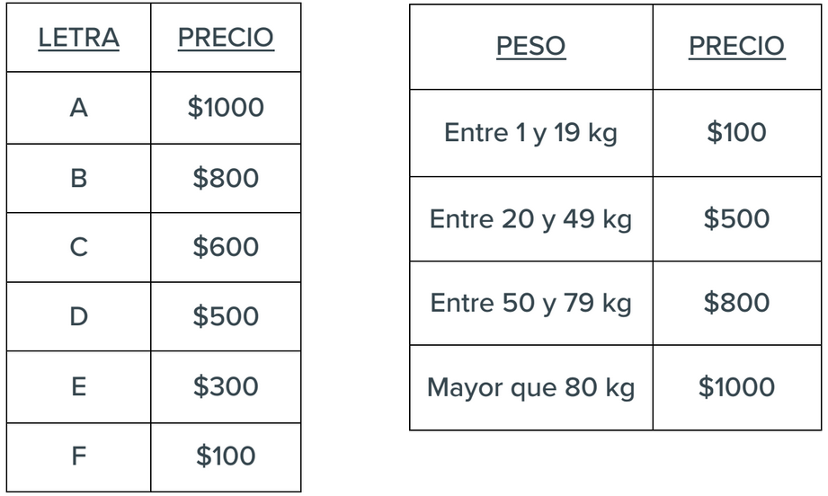

# egg-java-herencia

## Ejercicios

### 1. Animales
> Tenemos una clase padre Animal junto con sus 3 clases hijas: Perro, Gato, Caballo.  
La clase Animal tendrá como atributos el _nombre_, _alimento_, _edad_ y _raza_ del Animal.  
Crear un método en la clase Animal a través del cual cada clase hija deberá mostrar  
luego un mensaje por pantalla informando de qué se alimenta.

 

---

### 2. Electrodomésticos
> Crear una superclase llamada Electrodoméstico con los siguientes atributos:  
_precio_, _color_, _consumo energético_ (letras entre A y F) y _peso_.  

Los **constructores** que se deben implementar son los siguientes:  
• Un constructor vacío.  
• Un constructor con todos los atributos pasados por parámetro.  

Los **métodos** a implementar son:  
• Métodos getters y setters de todos los atributos.  

• Método `comprobarConsumoEnergetico(char letra)`: comprueba que la letra es correcta,  
si no lo es, usará la letra F por defecto. Este método se debe invocar al crear el objeto y no será visible.  

• Método `comprobarColor(String color)`: comprueba que el color es correcto, y si no lo es,
usará el color blanco por defecto.  
Los colores disponibles para los electrodomésticos son
_blanco_, _negro_, _rojo_, _azul_ y _gris_.  
No importa si el nombre está en mayúsculas o en
minúsculas. Este método se invocará al crear el objeto y no será visible.  

• Metodo `crearElectrodomestico()`: le pide la información al usuario y llena el
electrodoméstico,  
también llama los métodos para comprobar el color y el consumo. Al
precio se le da un valor base de $1000.  

• Método `precioFinal()`: según el consumo energético y su tamaño, aumentará el valor del
precio. Esta es la lista de precios:

 
  

> A continuación, se debe crear una subclase llamada Lavadora, con el atributo _carga_,
además de los atributos heredados.  

Los **constructores** que se implementarán serán:  
• Un constructor vacío.  
• Un constructor con la carga y el resto de los atributos heredados. Recuerda que debes llamar al constructor de la clase padre.  

Los **métodos** que se implementara serán:  
• Método get y set del atributo carga.  

• Método `crearLavadora()`: este método llama a `crearElectrodomestico()` de la clase
padre,  
lo utilizamos para llenar los atributos heredados del padre y después llenamos
el atributo propio de la lavadora.  

• Método `precioFinal()`. Este método será heredado y se le sumará la siguiente
funcionalidad:  
- si tiene una carga mayor de 30 Kg., aumentará el precio en $500;  
- si la carga es menor o igual, no se incrementará el precio.  
Este método debe llamar al
método padre y añadir el código necesario.  
Recuerda que las condiciones que hemos
visto en la clase Electrodoméstico también deben afectar al precio.  
  

> Se debe crear también una subclase llamada Televisor con los siguientes atributos:  
_resolución_ (en pulgadas) y _sintonizador TDT_ (booleano), además de los atributos
heredados.  

Los **constructores** que se implementarán serán:  
• Un constructor vacío.    
• Un constructor con la resolución, sintonizador TDT y el resto de los atributos
heredados.  
Recuerda que debes llamar al constructor de la clase padre.

Los **métodos** que se implementara serán:  
• Método get y set de los atributos resolución y sintonizador TDT.

• Método `crearTelevisor()`: este método llama a `crearElectrodomestico()` de la clase
padre,  
lo utilizamos para llenar los atributos heredados del padre y después llenamos los atributos del televisor.  

• Método `precioFinal()`. este método será heredado y se le sumará la siguiente
funcionalidad:  
- si el televisor tiene una resolución mayor de 40 pulgadas, se
incrementará el precio un 30%;  
- si tiene un sintonizador TDT incorporado, aumentará $500.  
Recuerda que las condiciones que hemos visto en la clase Electrodomestico
también deben afectar al precio.  
 
> Finalmente, en el `main` vamos a crear una Lavadora y un Televisor y  
llamar a los métodos necesarios para mostrar el precio final de los dos electrodomésticos.

---

### 3. Electrodomésticos

> Siguiendo el ejercicio anterior, en el `main` vamos a: 

- crear un ArrayList de Electrodomésticos  
para guardar 4 electrodomésticos, ya sean lavadoras o televisores, con valores ya asignados.  
- Luego, recorrer este array y ejecutar el método `precioFinal()` en cada electrodoméstico.  
- Se deberá también mostrar el precio de cada tipo de objeto, es decir, el precio de todos los  
televisores y el de las lavadoras.  
- Una vez hecho eso, también deberemos mostrar la suma del precio de todos los Electrodomésticos.  
Por ejemplo, si tenemos una lavadora con un precio de 2000 y un televisor de 5000,  
el resultado final será de 7000 para electrodomésticos, 2000 para lavadora y 5000 para televisor.

---

### 4. Formas geométricas

> Se plantea desarrollar un programa que nos permita calcular el área y el perímetro de formas  
geométricas. En este caso, un círculo y un rectángulo. Ya que este cálculo se va a repetir en las  
dos formas geométricas, vamos a crear una **Interfaz**, llamada `calculosFormas` que tendrá los  
dos métodos para calcular el área, el perímetro y el valor de PI como constante.  

Desarrollar el ejercicio para que las formas implementen los métodos de la interfaz y se  
calcule el área y el perímetro de los dos. En el main se crearán las formas y se mostrará el  
resultado final.  
Área circulo: PI * radio ^ 2 / Perímetro circulo: PI * diámetro.  
Área rectángulo: base * altura / Perímetro rectángulo: (base + altura) * 2.